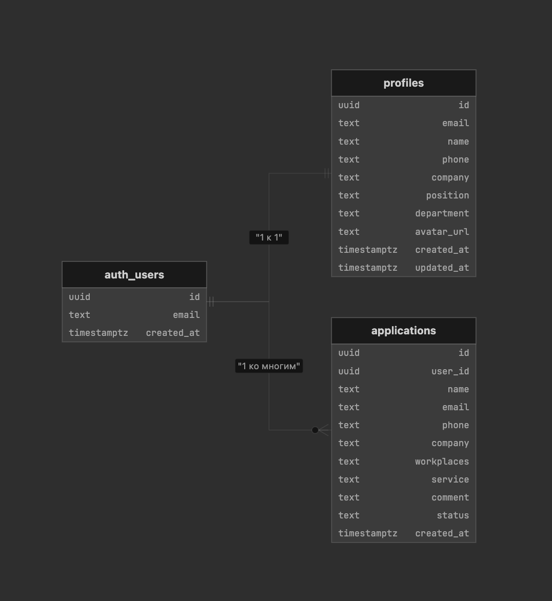

## We are sysadmins — документация (ветка `feature`)

Этот проект — лендинг и личный кабинет для команды **We are sysadmins**.  
Фронтенд — статический (`index.html`, `register.html`, `login.html`, `profile.html`), бэкенд‑часть реализована через **Supabase** (аутентификация, профили пользователей и заявки).

### Стек

- **Frontend**: чистые `HTML`, `CSS`, `JavaScript` (без фреймворков)
- **Auth**: Supabase Email Auth (`auth.users`)
- **БД**: Supabase Postgres (`profiles`, `applications`)
- **Хостинг**: GitHub Pages (`main` → GitHub Actions → Pages)

### Схема базы данных

Таблица пользователей `auth.users` — системная, она на схеме не показана, но используется как источник `auth.user().id` для связей.

### Таблицы Supabase (текстовое описание)

- **profiles**
  - `id uuid` — PK, совпадает с `auth.users.id` (1:1 с пользователем)
  - `email text`
  - `name text`
  - `phone text`
  - `avatar_url text`
  - `company text`
  - `position text`
  - `department text`
  - `is_admin boolean` — доступ к `admin.html` и просмотр всех заявок (по умолчанию `false`)
  - `created_at timestamptz`
  - `updated_at timestamptz`

- **applications**
  - `id uuid` — PK
  - `user_id uuid` — FK на `auth.users.id` (1 → many)
  - `name text`
  - `email text`
  - `phone text`
  - `company text`
  - `workplaces text`
  - `service text`
  - `comment text`
  - `status text` — `new` (новая), `in_progress` (в работе), `done` (завершена); отображение в ЛК см. `profile.js`
  - `created_at timestamptz`

### Как это связано с фронтендом

- Регистрация (`register.html`, `js/auth-register.js`):
  - `supabase.auth.signUp({ email, password })`
  - после успешной регистрации создаётся/обновляется запись в `profiles`.
- Вход (`login.html`, `js/auth-login.js`):
  - `supabase.auth.signInWithPassword({ email, password })`
  - после входа читается `profiles.is_admin`: при **`true`** → `admin.html`, иначе → `profile.html`.
- Профиль (`profile.html`, `js/profile.js`):
  - читает/обновляет `profiles` по `auth.user().id`
  - создаёт и показывает заявки из таблицы `applications`.
- Заявка с лендинга (`index.html` + Supabase):
  - форма «Заказать консультацию» создаёт запись в `applications` для текущего авторизованного пользователя.
- Админ-панель (`admin.html`, `js/admin-ui.js`):
  - после входа проверяется `profiles.is_admin`; иначе редирект на `profile.html`;
  - загружаются **все** заявки; кнопки **В работу** / **Завершить** / **Открыть снова** обновляют `applications.status` в БД;
  - клиент в `profile.html` при обновлении страницы видит те же статусы.

### SQL для админки и RLS

Выполните в Supabase → SQL скрипт **`supabase/admin-setup.sql`**: колонка `is_admin`, политики `SELECT`/`UPDATE` по всем заявкам для администраторов.

Затем в **Table Editor → profiles** у нужного пользователя выставьте **`is_admin` = true** (тот же `id`, что в **Authentication → Users**).

Убедитесь, что у обычных пользователей в RLS для `applications` есть правило вида «видеть только строки с `user_id = auth.uid()`» — иначе клиент не увидит свои заявки.

