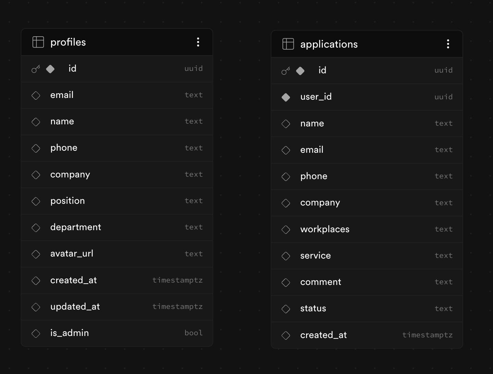

## We are sysadmins — документация (ветка `feature`)

> Этот README описывает состояние проекта на ветке **`feature`**. На `main` состав файлов и поведение могут отличаться.

Проект — лендинг и личный кабинет для команды **We are sysadmins**. Бэкенд — **Supabase** (вход, профили, заявки).

### Схема базы данных

Актуальная диаграмма для ветки `feature` (`images/base.png`).

Таблица `auth.users` системная; в UI Supabase на схеме `public` её часто не видно. Связи строятся через `auth.uid()` / `user.id`.

---

### Как устроена база простыми словами

#### 1. Таблица `auth.users` — системная
####таблицы связаны логически (по совпадающим UUID), но не скреплены напрямую FK, поэтому в ERD они “не связаны” визуально.

**Системная** значит: её ведёт не ваш обычный «код с формами», а сам **Supabase Auth**. Там живёт то, что нужно для **входа**: email, хэш пароля, служебные поля. Вы не рисуете эту таблицу в своём SQL как обычную «сущность заказов» — она уже есть в схеме **`auth`**.

**Зачем она вам:** после регистрации/входа Supabase выдаёт пользователю **один стабильный идентификатор** — `id` (uuid). Во всём приложении «кто сейчас вошёл» = этот `id` (и функция **`auth.uid()`** в базе — то же самое для правил доступа).

#### 2. Таблица `profiles` — ваша, про человека

Она в схеме **`public`** — это «наши» данные: имя, телефон, компания, фото, флаг админа и т.д.

**Связь с `auth.users`:** в `profiles` поле **`id`** **специально совпадает** с `auth.users.id`. То есть это не «случайный новый id», а **тот же человек**: одна строка в `auth.users` ↔ одна строка в `profiles` (связь **один к одному**).

**Зачем так сделано:** в `auth.users` нельзя/не нужно хранить всё подряд (должность, аватар data URL, `is_admin` для вашей логики). Вы **дополняете** аккаунт своей таблицей профиля, но **ключ остаётся общим** — тот же `id`.

**Поток в жизни сайта:** зарегистрировался → появился пользователь в `auth.users` → вы **создаёте или обновляете** строку в `profiles` с **тем же** `id`. В личном кабинете читаете и правите в основном **`profiles`**.

#### 3. Таблица `applications` — заявки

Каждая строка — одна заявка (консультация, услуга и т.д.).

**Связь:** поле **`user_id`** указывает на **`auth.users.id`** (логически это тот же человек, что и `profiles.id`). Один пользователь может иметь **много** заявок → связь **один ко многим**.

**Зачем дублируются имя/email в заявке:** в форме человек может написать контакты для **этой** заявки; они сохраняются в строке заявки, даже если в профиле другое.

**Поток:** с лендинга или из ЛК отправили форму → вставляется строка в `applications` с `user_id` = id вошедшего пользователя. В ЛК пользователь видит **только свои** строки (если в Supabase настроены политики **RLS**). Админ с `is_admin = true` в `profiles` может видеть **все** заявки и менять им **`status`** (`new` → `in_progress` → `done`).
